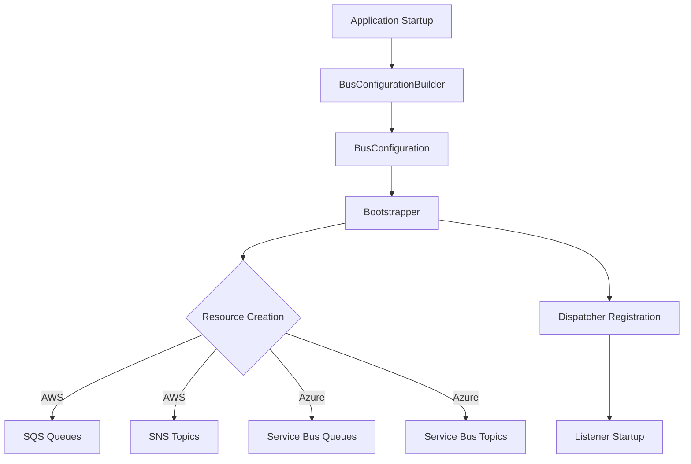
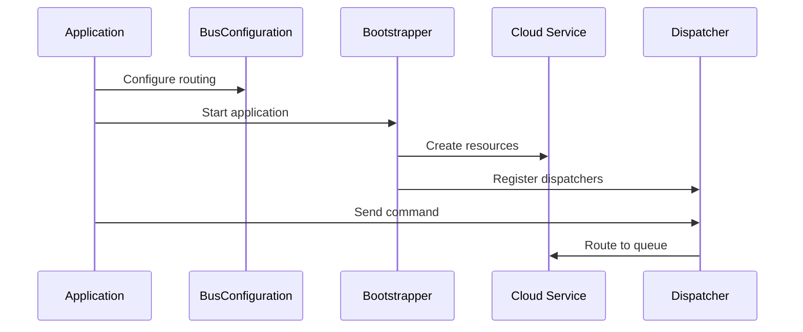
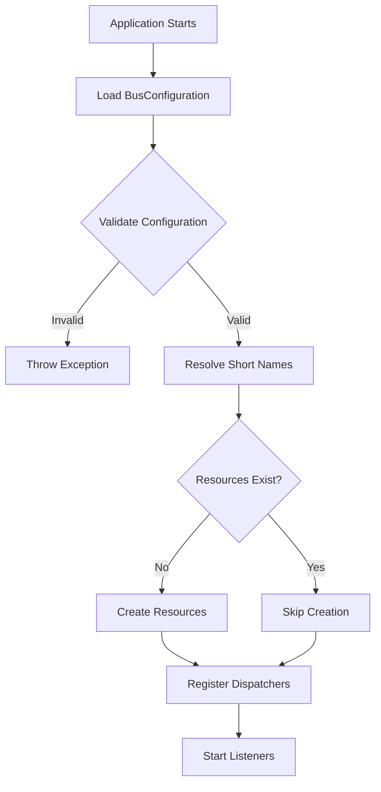

# Design Document: Bus Configuration System Documentation

## Overview

This design document outlines the approach for creating comprehensive user-facing documentation for the Bus Configuration System in SourceFlow.Net. The documentation will be added to existing documentation files and will provide developers with clear guidance on configuring command and event routing using the fluent API.

The Bus Configuration System is a code-first fluent API that simplifies the configuration of distributed messaging in cloud-based applications. It provides an intuitive, type-safe way to configure command routing, event publishing, queue listeners, and topic subscriptions without dealing with low-level cloud service details.

### Documentation Goals

1. **Clarity**: Make the Bus Configuration System easy to understand for developers new to SourceFlow.Net
2. **Completeness**: Cover all aspects of the Bus Configuration System including AWS and Azure specifics
3. **Practicality**: Provide working examples that developers can immediately use
4. **Discoverability**: Organize documentation so developers can quickly find what they need
5. **Maintainability**: Structure documentation for easy updates as the system evolves

## Architecture

### Documentation Structure

The documentation will be organized across multiple files to maintain clarity and separation of concerns:

#### 1. Main README.md Updates
- Add a brief mention of the Bus Configuration System in the v2.0.0 Roadmap section
- Add a link to detailed cloud configuration documentation
- Keep the main README focused on high-level overview

#### 2. docs/SourceFlow.Net-README.md Updates
- Add a new "Cloud Configuration" section after the "Advanced Configuration" section
- Provide an overview of the Bus Configuration System
- Include basic examples for both AWS and Azure
- Link to cloud-specific documentation for detailed information

#### 3. Steering File Updates
- Update `.kiro/steering/sourceflow-cloud-aws.md` with detailed AWS-specific Bus Configuration examples
- Update `.kiro/steering/sourceflow-cloud-azure.md` with detailed Azure-specific Bus Configuration examples
- These files already contain some Bus Configuration information, so we'll enhance and expand it

#### 4. docs/Cloud-Integration-Testing.md Updates
- Add a section on testing applications that use the Bus Configuration System
- Provide examples of unit and integration tests for Bus Configuration
- Document how to validate routing configuration

### Content Organization

Each documentation section will follow this structure:

1. **Introduction**: What is this feature and why use it?
2. **Quick Start**: Minimal example to get started
3. **Detailed Configuration**: Comprehensive explanation of all options
4. **Examples**: Real-world scenarios with complete code
5. **Best Practices**: Guidelines for effective use
6. **Troubleshooting**: Common issues and solutions
7. **Reference**: API documentation and configuration options

## Components and Interfaces

### Documentation Components

#### 1. Bus Configuration System Overview Section
**Location**: docs/SourceFlow.Net-README.md

**Content**:
- Introduction to the Bus Configuration System
- Key benefits (type safety, simplified configuration, automatic resource creation)
- Architecture diagram showing BusConfiguration, BusConfigurationBuilder, and Bootstrapper
- Comparison with manual configuration approach

**Structure**:
```markdown
## Cloud Configuration with Bus Configuration System

### Overview
[Introduction and benefits]

### Architecture
[Diagram and explanation]

### Quick Start
[Minimal example]

### Configuration Sections
[Send, Raise, Listen, Subscribe explanations]
```

#### 2. Fluent API Configuration Guide
**Location**: docs/SourceFlow.Net-README.md

**Content**:
- Detailed explanation of each fluent API section
- Send: Command routing configuration
- Raise: Event publishing configuration
- Listen: Command queue listener configuration
- Subscribe: Topic subscription configuration
- Complete working example combining all sections

**Structure**:
```markdown
### Fluent API Configuration

#### Send Commands
[Explanation and examples]

#### Raise Events
[Explanation and examples]

#### Listen to Command Queues
[Explanation and examples]

#### Subscribe to Topics
[Explanation and examples]

#### Complete Example
[Full configuration example]
```

#### 3. Bootstrapper Integration Guide
**Location**: docs/SourceFlow.Net-README.md

**Content**:
- Explanation of the bootstrapper's role
- How short names are resolved
- Automatic resource creation behavior
- Validation rules
- Execution timing
- Development vs. production considerations

**Structure**:
```markdown
### Bootstrapper Integration

#### How the Bootstrapper Works
[Explanation of bootstrapper process]

#### Resource Creation
[Automatic creation behavior]

#### Name Resolution
[Short name to full path resolution]

#### Validation Rules
[Configuration validation]

#### Best Practices
[When to use bootstrapper vs. IaC]
```

#### 4. AWS-Specific Configuration Guide
**Location**: .kiro/steering/sourceflow-cloud-aws.md

**Content**:
- AWS-specific Bus Configuration details
- SQS queue URL resolution
- SNS topic ARN resolution
- FIFO queue configuration with .fifo suffix
- IAM permission requirements
- Complete AWS examples

**Structure**:
```markdown
### Bus Configuration for AWS

#### Overview
[AWS-specific introduction]

#### Queue Configuration
[SQS queue configuration details]

#### Topic Configuration
[SNS topic configuration details]

#### FIFO Queues
[FIFO-specific configuration]

#### Examples
[Complete AWS examples]
```

#### 5. Azure-Specific Configuration Guide
**Location**: .kiro/steering/sourceflow-cloud-azure.md

**Content**:
- Azure-specific Bus Configuration details
- Service Bus queue configuration
- Service Bus topic configuration
- Session-enabled queues with .fifo suffix
- Managed Identity integration
- Complete Azure examples

**Structure**:
```markdown
### Bus Configuration for Azure

#### Overview
[Azure-specific introduction]

#### Queue Configuration
[Service Bus queue configuration details]

#### Topic Configuration
[Service Bus topic configuration details]

#### Session-Enabled Queues
[Session-specific configuration]

#### Examples
[Complete Azure examples]
```

#### 6. Circuit Breaker Enhancement Documentation
**Location**: docs/SourceFlow.Net-README.md (in existing resilience section)

**Content**:
- CircuitBreakerOpenException documentation
- CircuitBreakerStateChangedEventArgs documentation
- Event subscription examples
- Error handling patterns
- Monitoring and alerting integration

**Structure**:
```markdown
### Circuit Breaker Enhancements

#### CircuitBreakerOpenException
[Exception documentation and handling]

#### State Change Events
[Event subscription and monitoring]

#### Error Handling Patterns
[Best practices for handling circuit breaker states]
```

#### 7. Testing Guide
**Location**: docs/Cloud-Integration-Testing.md

**Content**:
- Unit testing Bus Configuration
- Integration testing with emulators
- Validating routing configuration
- Testing bootstrapper behavior
- Mocking strategies

**Structure**:
```markdown
### Testing Bus Configuration

#### Unit Testing
[Testing configuration without cloud services]

#### Integration Testing
[Testing with LocalStack/Azurite]

#### Validation Strategies
[Ensuring correct routing]

#### Examples
[Complete test examples]
```

## Data Models

### Documentation Examples Data Model

Each code example in the documentation will follow this structure:

```csharp
// Context comment explaining the scenario
public class ExampleScenario
{
    // Setup code with comments
    public void ConfigureServices(IServiceCollection services)
    {
        // Configuration code with inline comments
        services.UseSourceFlowAws(
            options => { 
                // Options configuration
            },
            bus => bus
                // Fluent API configuration with comments
                .Send
                    .Command<ExampleCommand>(q => q.Queue("example-queue"))
                // Additional configuration
        );
    }
}
```

### Diagram Models

Diagrams will be created using Mermaid syntax for maintainability:

#### Bus Configuration Architecture Diagram


#### Message Flow Diagram


#### Bootstrapper Process Diagram



## Correctness Properties

*A property is a characteristic or behavior that should hold true across all valid executions of a system—essentially, a formal statement about what the system should do. Properties serve as the bridge between human-readable specifications and machine-verifiable correctness guarantees.*

For documentation, properties validate that the documentation consistently meets quality standards across all sections and examples. While documentation quality has subjective elements, we can validate objective characteristics like completeness, consistency, and correctness of code examples.

### Property 1: Documentation Completeness

*For any* required documentation element specified in the requirements (Bus Configuration overview, fluent API sections, bootstrapper explanation, AWS/Azure specifics, Circuit Breaker enhancements, best practices, examples), the documentation files SHALL contain that element with appropriate detail.

**Validates: Requirements 1.2, 1.3, 1.4, 1.5, 2.1, 2.2, 2.3, 2.4, 2.5, 2.7, 3.1, 3.2, 3.3, 3.4, 3.5, 3.6, 4.1, 4.2, 4.3, 4.4, 4.5, 4.6, 5.1, 5.2, 5.3, 5.4, 5.5, 5.6, 6.1, 6.2, 6.3, 6.4, 6.5, 6.6, 6.7, 7.1, 7.2, 7.3, 7.4, 7.5, 7.6, 8.1, 8.2, 8.3, 8.4, 8.5, 8.6, 9.1, 9.2, 9.3, 9.4, 9.5, 10.2, 10.3, 10.4, 11.2, 11.4, 11.5, 11.6, 12.1, 12.2, 12.3**

This property ensures that all required documentation sections exist. We can validate this by searching for key terms and section headings in the documentation files.

### Property 2: Code Example Correctness

*For all* code examples in the documentation, they SHALL be syntactically correct C# code that compiles successfully, uses short queue/topic names (not full URLs/ARNs), includes necessary using statements, and uses proper markdown syntax highlighting.

**Validates: Requirements 2.6, 10.1, 10.5, 10.6**

This property ensures code examples are immediately usable by developers. We can validate this by:
- Extracting code blocks from markdown
- Verifying they compile with the SourceFlow.Net libraries
- Checking for full URLs/ARNs (should not exist)
- Verifying using statements are present
- Checking markdown code fence syntax includes "csharp" language identifier

### Property 3: Documentation Structure Consistency

*For all* documentation files, they SHALL follow consistent markdown structure with proper heading hierarchy (H1 → H2 → H3), consistent terminology for key concepts (Bus Configuration System, Bootstrapper, Fluent API), and proper formatting for code blocks and diagrams.

**Validates: Requirements 11.1, 11.3, 12.4, 12.5**

This property ensures documentation is well-organized and maintainable. We can validate this by:
- Parsing markdown to verify heading hierarchy (no skipped levels)
- Checking for consistent terminology across files
- Verifying Mermaid diagrams use proper syntax
- Ensuring diagrams have explanatory text nearby

### Property 4: Cross-Reference Integrity

*For all* cross-references and links in the documentation, they SHALL point to valid sections or files that exist in the documentation structure.

**Validates: Requirements 11.4**

This property ensures navigation works correctly. We can validate this by:
- Extracting all markdown links
- Verifying internal links point to existing sections
- Verifying file references point to existing files

## Error Handling

### Documentation Validation Errors

The documentation creation process should handle these error scenarios:

1. **Missing Required Sections**
   - Error: A required documentation element is not present
   - Handling: Validation script reports missing sections with requirement references
   - Prevention: Use checklist during documentation writing

2. **Invalid Code Examples**
   - Error: Code example does not compile
   - Handling: Compilation errors reported with line numbers and file locations
   - Prevention: Test all code examples before committing

3. **Broken Cross-References**
   - Error: Link points to non-existent section or file
   - Handling: Validation script reports broken links
   - Prevention: Use relative links and verify after restructuring

4. **Inconsistent Terminology**
   - Error: Same concept referred to with different terms
   - Handling: Linting script reports terminology inconsistencies
   - Prevention: Maintain glossary and use consistent terms

5. **Improper Heading Hierarchy**
   - Error: Heading levels skip (e.g., H1 → H3)
   - Handling: Markdown linter reports hierarchy violations
   - Prevention: Follow markdown best practices

### Documentation Update Errors

When updating existing documentation:

1. **Merge Conflicts**
   - Error: Documentation files have been modified by others
   - Handling: Carefully review and merge changes
   - Prevention: Coordinate documentation updates

2. **Breaking Existing Links**
   - Error: Restructuring breaks existing cross-references
   - Handling: Update all affected links
   - Prevention: Run link validation before committing

## Testing Strategy

### Documentation Validation Approach

The documentation will be validated using a dual approach:

1. **Manual Review**: Human review for clarity, completeness, and quality
2. **Automated Validation**: Scripts to verify objective properties

### Automated Validation Tests

#### Unit Tests for Documentation Properties

**Test 1: Documentation Completeness Validation**
- Extract list of required elements from requirements
- Search documentation files for each element
- Report missing elements
- Tag: **Feature: bus-configuration-documentation, Property 1: Documentation Completeness**

**Test 2: Code Example Compilation**
- Extract all C# code blocks from markdown files
- Create temporary test projects
- Attempt to compile each code example
- Report compilation errors with context
- Tag: **Feature: bus-configuration-documentation, Property 2: Code Example Correctness**

**Test 3: Short Name Validation**
- Extract all code examples
- Search for patterns matching full URLs/ARNs (https://, arn:aws:)
- Report violations with file and line number
- Tag: **Feature: bus-configuration-documentation, Property 2: Code Example Correctness**

**Test 4: Using Statement Validation**
- Extract all code examples
- Verify presence of using statements
- Report examples missing using statements
- Tag: **Feature: bus-configuration-documentation, Property 2: Code Example Correctness**

**Test 5: Markdown Structure Validation**
- Parse markdown files
- Verify heading hierarchy (no skipped levels)
- Verify code blocks have language identifiers
- Report structure violations
- Tag: **Feature: bus-configuration-documentation, Property 3: Documentation Structure Consistency**

**Test 6: Terminology Consistency**
- Define canonical terms (Bus Configuration System, Bootstrapper, etc.)
- Search for variations or inconsistent usage
- Report inconsistencies
- Tag: **Feature: bus-configuration-documentation, Property 3: Documentation Structure Consistency**

**Test 7: Mermaid Diagram Validation**
- Extract Mermaid diagram blocks
- Verify Mermaid syntax is valid
- Verify diagrams have nearby explanatory text
- Report invalid diagrams
- Tag: **Feature: bus-configuration-documentation, Property 3: Documentation Structure Consistency**

**Test 8: Cross-Reference Validation**
- Extract all markdown links
- Verify internal links point to existing sections
- Verify file references point to existing files
- Report broken links
- Tag: **Feature: bus-configuration-documentation, Property 4: Cross-Reference Integrity**

### Manual Review Checklist

For each documentation section, reviewers should verify:

- [ ] Content is clear and understandable
- [ ] Examples are realistic and practical
- [ ] Explanations are accurate and complete
- [ ] Tone is consistent with SourceFlow.Net style
- [ ] Technical details are correct
- [ ] Best practices are sound
- [ ] Troubleshooting guidance is helpful

### Integration Testing

**Test Documentation with Real Projects**:
- Create sample projects following documentation examples
- Verify examples work as documented
- Test with both AWS and Azure configurations
- Validate bootstrapper behavior matches documentation

### Property-Based Testing Configuration

Each property test should run with:
- **Minimum 100 iterations** for randomized validation
- **Test data generators** for various documentation scenarios
- **Shrinking** to find minimal failing examples
- **Clear failure messages** with file locations and line numbers

Example property test configuration:
```csharp
[Property(MaxTest = 100)]
public Property DocumentationCompletenessProperty()
{
    return Prop.ForAll(
        RequiredElementGenerator(),
        requiredElement => 
        {
            var documentationFiles = LoadDocumentationFiles();
            var elementExists = documentationFiles.Any(f => 
                f.Content.Contains(requiredElement.SearchTerm));
            
            return elementExists.Label($"Required element '{requiredElement.Name}' exists");
        });
}
```

### Testing Tools

- **Markdown Parser**: Markdig or similar for parsing markdown structure
- **C# Compiler**: Roslyn for compiling code examples
- **Link Checker**: Custom script for validating cross-references
- **Mermaid Validator**: Mermaid CLI for diagram validation
- **Property Testing**: FsCheck for property-based validation

## Implementation Approach

### Phase 1: Main Documentation Updates

1. Update `docs/SourceFlow.Net-README.md`:
   - Add "Cloud Configuration with Bus Configuration System" section
   - Include overview, architecture diagram, and quick start
   - Add detailed fluent API configuration guide
   - Add bootstrapper integration guide
   - Update Circuit Breaker section with new enhancements

2. Update `README.md`:
   - Add brief mention of Bus Configuration System in v2.0.0 roadmap
   - Add link to detailed cloud configuration documentation

### Phase 2: Cloud-Specific Documentation

3. Update `.kiro/steering/sourceflow-cloud-aws.md`:
   - Enhance existing Bus Configuration section
   - Add detailed AWS-specific examples
   - Document SQS/SNS specific behaviors
   - Add IAM permission requirements

4. Update `.kiro/steering/sourceflow-cloud-azure.md`:
   - Enhance existing Bus Configuration section
   - Add detailed Azure-specific examples
   - Document Service Bus specific behaviors
   - Add Managed Identity integration details

### Phase 3: Testing Documentation

5. Update `docs/Cloud-Integration-Testing.md`:
   - Add "Testing Bus Configuration" section
   - Provide unit testing examples
   - Provide integration testing examples
   - Document validation strategies

### Phase 4: Validation and Review

6. Create validation scripts:
   - Documentation completeness checker
   - Code example compiler
   - Link validator
   - Structure validator

7. Run validation and fix issues

8. Manual review and refinement

### Content Writing Guidelines

**Tone and Style**:
- Professional but approachable
- Focus on practical guidance
- Use active voice
- Keep sentences concise
- Provide context before details

**Code Examples**:
- Always include complete, runnable examples
- Add comments explaining key concepts
- Show realistic scenarios
- Include error handling where appropriate
- Use meaningful names (not foo/bar)

**Structure**:
- Start with overview and benefits
- Provide quick start for immediate value
- Follow with detailed explanations
- Include best practices and troubleshooting
- End with references and links

**Diagrams**:
- Use Mermaid for all diagrams
- Keep diagrams focused and simple
- Add captions explaining the diagram
- Use consistent styling and terminology

### File Organization

```
SourceFlow.Net/
├── README.md                              # Brief mention + link
├── docs/
│   ├── SourceFlow.Net-README.md          # Main Bus Config documentation
│   └── Cloud-Integration-Testing.md       # Testing documentation
└── .kiro/
    └── steering/
        ├── sourceflow-cloud-aws.md        # AWS-specific details
        └── sourceflow-cloud-azure.md      # Azure-specific details
```

### Documentation Maintenance

**Version Control**:
- Track documentation changes with meaningful commit messages
- Review documentation updates in pull requests
- Keep documentation in sync with code changes

**Updates**:
- Update documentation when Bus Configuration System changes
- Add new examples as patterns emerge
- Incorporate user feedback and questions
- Keep troubleshooting section current

**Quality Assurance**:
- Run validation scripts before committing
- Review for clarity and accuracy
- Test all code examples
- Verify all links work

## Success Criteria

The documentation will be considered complete and successful when:

1. **Completeness**: All required elements from requirements are present
2. **Correctness**: All code examples compile and run successfully
3. **Consistency**: Terminology and structure are consistent across files
4. **Clarity**: Developers can successfully configure Bus Configuration System using only the documentation
5. **Validation**: All automated validation tests pass
6. **Review**: Manual review confirms quality and accuracy

## Future Enhancements

Potential future improvements to the documentation:

1. **Video Tutorials**: Create video walkthroughs of Bus Configuration setup
2. **Interactive Examples**: Provide online playground for testing configurations
3. **Migration Tools**: Create automated tools to convert manual configuration to fluent API
4. **Configuration Visualizer**: Tool to visualize routing configuration
5. **Best Practices Library**: Curated collection of configuration patterns
6. **Troubleshooting Database**: Searchable database of common issues and solutions
