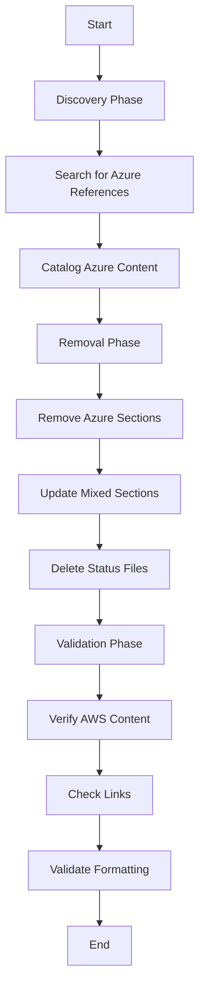

# Design Document: v2.0.0 Release Preparation

## Overview

This design document specifies the technical approach for preparing the v2.0.0 release of SourceFlow.Net by removing all Azure-related content from documentation while preserving comprehensive AWS cloud integration documentation. This is a documentation-only release preparation with no code changes required.

The design focuses on systematic file-by-file updates using search patterns, content removal strategies, and validation steps to ensure documentation quality and completeness.

## Architecture

### Documentation Update Strategy

The architecture follows a three-phase approach:

1. **Discovery Phase** - Identify all Azure references using systematic search patterns
2. **Removal Phase** - Remove Azure content while preserving AWS content using targeted edits
3. **Validation Phase** - Verify completeness, accuracy, and quality of updated documentation



### File Processing Order

Files will be processed in dependency order to minimize broken references:

1. **Cloud-Integration-Testing.md** - Remove Azure testing documentation
2. **Idempotency-Configuration-Guide.md** - Remove Azure configuration examples
3. **SourceFlow.Net-README.md** - Remove Azure integration sections
4. **CHANGELOG.md** - Update for AWS-only release
5. **SourceFlow.Stores.EntityFramework-README.md** - Clean up Azure references
6. **Repository-wide** - Remove status tracking files

## Components and Interfaces

### Search Patterns

The following search patterns will be used to identify Azure content:

```regex
# Primary Azure service references
Azure|azure
Service Bus|ServiceBus
Key Vault|KeyVault
Azurite
AzureServiceBus
AzureKeyVault

# Azure-specific classes and methods
UseSourceFlowAzure
AzureBusBootstrapper
AzureServiceBusCommandDispatcher
AzureServiceBusEventDispatcher
AzureServiceBusCommandListener
AzureServiceBusEventListener
AzureHealthCheck
AzureDeadLetterMonitor
AzureTelemetryExtensions

# Azure configuration
FullyQualifiedNamespace
ServiceBusConnectionString
UseManagedIdentity

# Status file patterns
*STATUS*.md
*COMPLETE*.md
*VALIDATION*.md
```

### Content Removal Strategy

#### Strategy 1: Complete Section Removal

For sections that are entirely Azure-specific:

1. Identify section boundaries (markdown headers)
2. Remove entire section including all subsections
3. Adjust surrounding content for flow

**Example Sections:**
- "Azure Configuration Example"
- "Azure Cloud Integration Testing (Complete)"
- "SourceFlow.Cloud.Azure v2.0.0"

#### Strategy 2: Selective Content Removal

For sections containing both AWS and Azure content:

1. Identify Azure-specific paragraphs, code blocks, or list items
2. Remove only Azure content
3. Preserve AWS content and adjust formatting
4. Ensure remaining content is coherent

**Example Sections:**
- Cloud configuration overview (remove Azure, keep AWS)
- Multi-cloud diagrams (remove Azure nodes)
- Comparison tables (remove Azure columns)

#### Strategy 3: Reference Updates

For sections that reference Azure in passing:

1. Remove Azure from lists or comparisons
2. Update text to reference only AWS
3. Remove "AWS/Azure" phrasing, use "AWS" only

**Example Updates:**
- "AWS and Azure" → "AWS"
- "LocalStack (AWS) or Azurite (Azure)" → "LocalStack"
- "Cloud Agnostic - Same API works for both AWS and Azure" → Remove this benefit

## Data Models

### File Update Specification

Each file to be updated follows this data model:

```csharp
public class FileUpdateSpec
{
    public string FilePath { get; set; }
    public List<SectionRemoval> SectionsToRemove { get; set; }
    public List<ContentUpdate> SelectiveUpdates { get; set; }
    public List<ReferenceUpdate> ReferenceUpdates { get; set; }
    public ValidationRules ValidationRules { get; set; }
}

public class SectionRemoval
{
    public string SectionTitle { get; set; }
    public int StartLine { get; set; }
    public int EndLine { get; set; }
    public RemovalStrategy Strategy { get; set; }
}

public class ContentUpdate
{
    public string SearchPattern { get; set; }
    public string ReplacementText { get; set; }
    public UpdateType Type { get; set; } // Remove, Replace, Modify
}

public class ValidationRules
{
    public List<string> RequiredSections { get; set; }
    public List<string> ForbiddenPatterns { get; set; }
    public bool ValidateLinks { get; set; }
    public bool ValidateCodeBlocks { get; set; }
}
```

### Documentation Quality Metrics

```csharp
public class DocumentationQualityMetrics
{
    public int AzureReferencesRemoved { get; set; }
    public int AwsSectionsPreserved { get; set; }
    public int BrokenLinksFixed { get; set; }
    public int StatusFilesDeleted { get; set; }
    public bool AllValidationsPassed { get; set; }
}
```

## Correctness Properties

*A property is a characteristic or behavior that should hold true across all valid executions of a system-essentially, a formal statement about what the system should do. Properties serve as the bridge between human-readable specifications and machine-verifiable correctness guarantees.*

### Analysis

This specification describes a documentation update task with specific, concrete requirements for removing Azure content from specific files. All acceptance criteria are manual editing and verification tasks that do not lend themselves to property-based testing across random inputs.

The requirements specify:
- Specific files to edit (Cloud-Integration-Testing.md, Idempotency-Configuration-Guide.md, etc.)
- Specific content to remove (Azure sections, Azure code examples, Azure references)
- Specific content to preserve (AWS sections, AWS code examples)
- Specific files to delete (status tracking files)
- Quality verification tasks (link validation, formatting checks)

These are deterministic, one-time operations on specific files rather than universal properties that should hold across all inputs. The "correctness" of this work is verified through manual review and validation checklists rather than automated property-based tests.

### Testable Properties

After analyzing all acceptance criteria, there are **no testable properties** suitable for property-based testing. All requirements are specific documentation editing tasks that require manual execution and verification.

However, we can define **validation checks** that should pass after the work is complete:

### Validation Check 1: Azure Reference Removal

After all updates are complete, searching for Azure-related patterns in documentation files should return zero results (excluding historical changelog entries if preserved for context).

**Validation Command:**
```bash
grep -r "Azure\|azure\|ServiceBus\|KeyVault\|Azurite" docs/ --include="*.md" --exclude="*CHANGELOG*"
```

**Expected Result:** No matches found

**Validates: Requirements 1.1-1.11, 2.1-2.4, 3.1-3.5, 5.2**

### Validation Check 2: AWS Content Preservation

After all updates are complete, all AWS-related sections should remain intact with valid syntax.

**Validation Approach:**
- Verify AWS code examples compile/parse correctly
- Verify AWS configuration sections are complete
- Verify AWS testing documentation is comprehensive

**Validates: Requirements 1.12-1.15, 2.5-2.7, 3.6-3.9, 7.1-7.3**

### Validation Check 3: Status File Removal

After cleanup, no status tracking files should exist in the repository.

**Validation Command:**
```bash
find . -type f -name "*STATUS*.md" -o -name "*COMPLETE*.md" -o -name "*VALIDATION*.md"
```

**Expected Result:** No files found

**Validates: Requirements 6.1-6.5**

### Validation Check 4: Link Integrity

After all updates are complete, all internal documentation links should resolve correctly.

**Validation Approach:**
- Parse all markdown files for internal links
- Verify each link target exists
- Verify no links point to removed Azure content

**Validates: Requirements 7.7, 8.6**

### Validation Check 5: Markdown Syntax Validity

After all updates are complete, all markdown files should have valid syntax.

**Validation Approach:**
- Use markdown linter to check syntax
- Verify code block delimiters are balanced
- Verify heading hierarchy is correct
- Verify list formatting is consistent

**Validates: Requirements 8.1-8.8**

## Error Handling

### Error Scenarios

1. **Incomplete Azure Removal**
   - **Detection:** Validation Check 1 finds remaining Azure references
   - **Resolution:** Review flagged content and determine if it should be removed or is acceptable (e.g., historical context)

2. **Accidental AWS Content Removal**
   - **Detection:** Validation Check 2 finds missing AWS sections
   - **Resolution:** Restore AWS content from version control

3. **Broken Links**
   - **Detection:** Validation Check 4 finds broken internal links
   - **Resolution:** Update links to point to correct targets or remove if target was intentionally removed

4. **Markdown Syntax Errors**
   - **Detection:** Validation Check 5 finds syntax issues
   - **Resolution:** Fix syntax errors (unbalanced code blocks, incorrect heading levels, etc.)

5. **Status Files Remain**
   - **Detection:** Validation Check 3 finds status files
   - **Resolution:** Delete remaining status files

### Rollback Strategy

If critical errors are discovered after updates:

1. Use git to revert specific file changes
2. Re-apply updates with corrections
3. Re-run validation checks

## Testing Strategy

### Manual Testing Approach

Since this is a documentation update task, testing consists of manual review and validation checks rather than automated unit or property-based tests.

### Testing Phases

#### Phase 1: Pre-Update Validation

Before making any changes:

1. **Baseline Documentation** - Create git branch for all changes
2. **Catalog Azure Content** - Document all Azure references found
3. **Identify AWS Content** - Document all AWS sections to preserve
4. **Review Status Files** - List all status files to delete

#### Phase 2: Incremental Updates with Validation

For each file:

1. **Make Updates** - Apply removal and update strategies
2. **Local Validation** - Run validation checks on updated file
3. **Visual Review** - Manually review changes for quality
4. **Commit Changes** - Commit file with descriptive message

#### Phase 3: Final Validation

After all files are updated:

1. **Run All Validation Checks** - Execute Validation Checks 1-5
2. **Manual Review** - Read through all updated documentation
3. **Link Testing** - Click through all internal links
4. **AWS Completeness Review** - Verify AWS documentation is comprehensive

### Validation Checklist

```markdown
## Cloud-Integration-Testing.md
- [ ] All Azure testing sections removed
- [ ] All AWS testing sections preserved
- [ ] Overview updated to reference only AWS
- [ ] No broken links
- [ ] Markdown syntax valid

## Idempotency-Configuration-Guide.md
- [ ] All Azure configuration examples removed
- [ ] All AWS configuration examples preserved
- [ ] Default behavior section references only AWS
- [ ] No broken links
- [ ] Markdown syntax valid

## SourceFlow.Net-README.md
- [ ] All Azure configuration sections removed
- [ ] All AWS configuration sections preserved
- [ ] Cloud configuration overview references only AWS
- [ ] Bus configuration examples show only AWS
- [ ] Mermaid diagrams updated (Azure nodes removed)
- [ ] No broken links
- [ ] Markdown syntax valid

## CHANGELOG.md
- [ ] Azure-related sections removed
- [ ] AWS-related sections preserved
- [ ] Note added indicating v2.0.0 supports AWS only
- [ ] Package dependencies list only AWS extension
- [ ] No broken links
- [ ] Markdown syntax valid

## SourceFlow.Stores.EntityFramework-README.md
- [ ] Azure-specific examples removed (if any)
- [ ] Cloud-agnostic examples preserved
- [ ] AWS-compatible examples preserved
- [ ] No broken links
- [ ] Markdown syntax valid

## Repository-wide
- [ ] All status files deleted
- [ ] No Azure references in documentation (except historical context)
- [ ] All AWS content preserved and complete
- [ ] All internal links valid
- [ ] Consistent formatting across files
```

### Testing Tools

1. **grep/ripgrep** - Search for Azure references
2. **find** - Locate status files
3. **markdownlint** - Validate markdown syntax
4. **markdown-link-check** - Validate internal links
5. **git diff** - Review changes before committing

### Success Criteria

The documentation update is successful when:

1. All validation checks pass (Checks 1-5)
2. All items in validation checklist are complete
3. Manual review confirms documentation quality
4. AWS documentation is comprehensive and accurate
5. No Azure references remain (except acceptable historical context)

## Implementation Notes

### File-Specific Update Details

#### Cloud-Integration-Testing.md

**Sections to Remove Completely:**
- "Azure Cloud Integration Testing (Complete)" section
- All Azure property-based tests (Properties 1-29)
- Azure Service Bus integration test descriptions
- Azure Key Vault integration test descriptions
- Azure health check test descriptions
- Azure performance testing sections
- Azure resilience testing sections
- Azure CI/CD integration sections
- Azure security testing sections
- Azurite emulator references and setup instructions
- Cross-cloud integration testing sections

**Sections to Update:**
- Overview: Remove Azure references, update to "AWS cloud integration"
- Testing framework description: Remove Azure mentions

**Sections to Preserve:**
- All AWS testing documentation
- AWS property-based tests (Properties 1-16)
- LocalStack integration test documentation
- AWS-specific testing strategies

#### Idempotency-Configuration-Guide.md

**Sections to Remove Completely:**
- "Azure Example" sections
- "Azure Configuration" sections
- "Azure Example (Coming Soon)" section
- "Registration Flow (Azure)" section

**Content to Remove:**
- Azure Service Bus connection string examples
- Azure managed identity configuration examples
- `UseSourceFlowAzure` code examples
- `FullyQualifiedNamespace` configuration examples

**Sections to Update:**
- Overview: Change "AWS or Azure" to "AWS"
- Default behavior: Reference only AWS
- Multi-instance deployment: Reference only AWS

**Sections to Preserve:**
- All AWS configuration examples
- AWS SQS/SNS configuration examples
- AWS IAM configuration examples
- Fluent builder API documentation
- Entity Framework idempotency setup

#### SourceFlow.Net-README.md

**Sections to Remove Completely:**
- "Azure Configuration Example" section
- Azure Service Bus setup examples
- Azure Key Vault encryption examples
- Azure managed identity authentication examples
- Azure health check configuration examples

**Content to Remove:**
- Azure nodes from Mermaid diagrams
- "Cloud Agnostic - Same API works for both AWS and Azure" benefit
- Azure-specific routing examples
- References to Azure Service Bus queues/topics

**Sections to Update:**
- Cloud configuration overview: Remove "AWS and Azure", use "AWS"
- Bus configuration system: Remove Azure mentions
- FIFO/Session comparison: Remove Azure session-enabled queues
- Testing section: Remove "Azurite (Azure)"

**Sections to Preserve:**
- All AWS configuration sections
- AWS SQS/SNS setup examples
- AWS KMS encryption examples
- AWS IAM authentication examples
- AWS-specific bus configuration examples

#### CHANGELOG.md

**Sections to Remove Completely:**
- "SourceFlow.Cloud.Azure v2.0.0" section
- Azure cloud extension breaking changes
- Azure namespace change documentation
- Azure migration guide sections
- Azure integration feature descriptions

**Content to Add:**
- Note indicating v2.0.0 supports AWS cloud integration only
- Explanation that Azure support has been removed

**Sections to Update:**
- Package dependencies: List only AWS extension
- Upgrade path: Remove Azure references
- Related documentation: Remove Azure links

**Sections to Preserve:**
- All AWS-related sections
- AWS cloud extension documentation
- AWS namespace change documentation
- AWS migration guide sections
- Core framework changes

#### SourceFlow.Stores.EntityFramework-README.md

**Review Focus:**
- Search for Azure-specific configuration examples
- Search for Azure Service Bus references
- Search for Azure-specific deployment scenarios

**Expected Changes:**
- Minimal changes expected (this is primarily database-focused)
- May need to update "Cloud Messaging" example to reference only AWS SQS
- Preserve all database provider examples (SQL Server, PostgreSQL, MySQL, SQLite)

### Status File Deletion

**Search Patterns:**
```bash
find . -type f \( -name "*STATUS*.md" -o -name "*COMPLETE*.md" -o -name "*VALIDATION*.md" \)
```

**Expected Files:**
- Any markdown files with STATUS, COMPLETE, or VALIDATION in filename
- Typically found in docs/ or .kiro/ directories

**Deletion Strategy:**
- Review each file to confirm it's a status tracking file
- Delete confirmed status files
- Verify no production documentation is accidentally deleted

### Link Validation Strategy

**Internal Link Patterns:**
```regex
\[.*\]\((?!http).*\.md.*\)
\[.*\]\(\.kiro/.*\)
```

**Validation Steps:**
1. Extract all internal links from markdown files
2. Resolve relative paths
3. Check if target file exists
4. Check if target anchor exists (for #anchor links)
5. Report broken links for manual review

**Common Link Issues:**
- Links to removed Azure documentation
- Links to deleted status files
- Broken anchor references after section removal

## Deployment Considerations

### Version Control Strategy

1. **Create Feature Branch**
   ```bash
   git checkout -b release/v2.0.0-docs-cleanup
   ```

2. **Commit Strategy**
   - One commit per file updated
   - Descriptive commit messages
   - Example: "docs: remove Azure content from Cloud-Integration-Testing.md"

3. **Pull Request**
   - Include validation checklist in PR description
   - Request review from documentation maintainers
   - Include before/after comparison for key sections

### Release Process

1. **Merge Documentation Updates**
   - Merge feature branch to main
   - Tag commit as v2.0.0-docs

2. **Update Package Metadata**
   - Verify .csproj files reference correct versions
   - Verify NuGet package descriptions are accurate

3. **Publish Release**
   - Create GitHub release for v2.0.0
   - Include release notes from CHANGELOG.md
   - Highlight AWS-only support

### Post-Release Validation

1. **Documentation Site**
   - Verify documentation renders correctly
   - Test all links on published documentation

2. **User Communication**
   - Announce v2.0.0 release
   - Clarify AWS-only support
   - Provide migration guidance for Azure users (if applicable)

## Maintenance Considerations

### Future Documentation Updates

1. **Consistency**
   - All new documentation should reference only AWS
   - Use AWS examples for cloud integration
   - Avoid "cloud-agnostic" claims

2. **Version History**
   - Maintain CHANGELOG.md with accurate version history
   - Document any future cloud provider additions

3. **Link Maintenance**
   - Regularly validate internal links
   - Update links when files are moved or renamed

### Quality Standards

1. **Markdown Formatting**
   - Use consistent heading levels
   - Use consistent code block syntax (```csharp, ```bash, etc.)
   - Use consistent list formatting

2. **Code Examples**
   - Ensure all code examples are syntactically correct
   - Use realistic configuration values
   - Include necessary using statements

3. **Technical Accuracy**
   - Verify AWS service names are correct
   - Verify AWS configuration examples are valid
   - Verify AWS API usage is current

## Conclusion

This design provides a systematic approach to preparing the v2.0.0 release documentation by removing all Azure-related content while preserving comprehensive AWS cloud integration documentation. The file-by-file update strategy with validation checks ensures documentation quality and completeness.

The implementation will be manual documentation editing with validation checks to verify correctness rather than automated property-based testing, as the requirements specify specific content removal from specific files rather than universal properties across random inputs.
