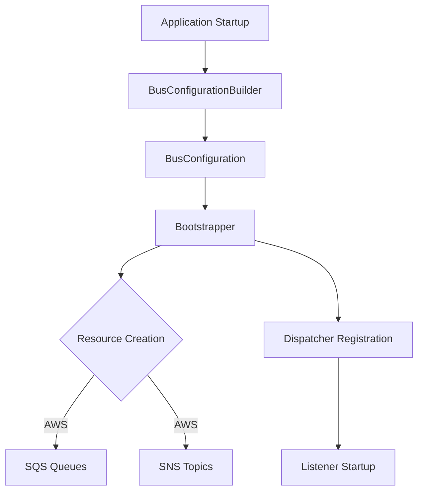

# SourceFlow.Net

A modern, lightweight, and extensible .NET framework for building event-sourced applications using Domain-Driven Design (DDD) principles and Command Query Responsibility Segregation (CQRS) patterns.
> Build scalable, maintainable applications with complete event sourcing, aggregate pattern implementation, saga orchestration for long-running transactions, and view model projections.

---

## 🚀 Overview

SourceFlow.Net is a comprehensive event sourcing and CQRS framework that empowers developers to build scalable, maintainable applications with complete audit trails. Built from the ground up for modern .NET development with performance and developer experience as core priorities.

### Key Features

- 🏗️ **Domain-Driven Design (DDD)** - Complete support for domain modeling and bounded contexts
- ⚡ **CQRS Implementation** - Command/Query separation for optimized read and write operations
- 📊 **Event-First Design** - Foundation built on event sourcing with complete audit trails
- 🧱 **Clean Architecture** - Separation of concerns with clear architectural boundaries
- ☁️ **Cloud-Native Messaging** - Built-in bus configuration with fluent API for distributed command/event routing
- 🔒 **Security** - Message encryption (KMS), sensitive data masking, and dead letter queue processing
- 🔄 **Resilience** - Circuit breakers, retry policies, and idempotency for duplicate message detection
- 📈 **Observability** - Integrated OpenTelemetry support for monitoring and tracing across cloud operations
- 🔧 **Extensible** - Pluggable persistence, messaging, and cloud provider layers (AWS, Azure)

### 🎯 Core Architecture

SourceFlow.Net implements the following architectural patterns:

#### **Aggregates** (Dual Role: Command Publisher & Event Subscriber)
- Encapsulate root domain entities within bounded contexts
- Command Publisher: Provide the API for publishing commands to initiate state changes
- Event Subscriber: Subscribe to events to react to external changes from other sagas or workflows
- Manage consistency boundaries for domain invariants
- Unique in their dual responsibility of both publishing commands and subscribing to events

#### **Sagas**
- Command Subscriber: Subscribe to commands and execute updates to aggregate entities
- Orchestrate long-running business processes and transactions
- Manage both success and failure flows to ensure data consistency
- Publish commands to themselves or other sagas to coordinate multi-step workflows
- Raise events during command handling to notify other components of state changes

#### **Events**
- Immutable notifications of state changes that have occurred
- Published to interested subscribers when state changes occur
- Two primary subscribers:
  - **Aggregates**: React to events from external workflows that impact their domain state
  - **Views**: Project event data into optimized read models for query operations

#### **Views & ViewModels**
- Event Subscriber: Subscribe to events and transform domain data into denormalized read models
- Provide optimized read access for consumers such as UIs or reporting systems
- Support eventual consistency patterns for high-performance queries

---

## 📦 Installation

Install the core SourceFlow.Net package using NuGet Package Manager:

```bash
# Core framework
dotnet add package SourceFlow.Net

# Entity Framework persistence (optional but recommended)
dotnet add package SourceFlow.Stores.EntityFramework

# AWS Cloud Provider (optional)
dotnet add package SourceFlow.Cloud.AWS
```

### .NET Framework Support
- .NET Standard 2.0 / 2.1
- .NET 8.0 / 9.0 / 10.0

---

## ☁️ What's New in v2.0.0 — Cloud-Native Architecture

Version 2.0.0 consolidates all cloud abstractions into the core SourceFlow.Net package, eliminating the need for a separate `SourceFlow.Cloud.Core` dependency. Cloud provider packages (e.g., `SourceFlow.Cloud.AWS`) now depend only on the core package.

### Cloud Abstractions in Core

The following are now part of `SourceFlow.Net`:

| Feature | Namespace | Description |
|---------|-----------|-------------|
| **Bus Configuration** | `SourceFlow.Cloud.Configuration` | Fluent API for command/event routing (`.Send.Command`, `.Raise.Event`, `.Listen.To`, `.Subscribe.To`) |
| **Circuit Breaker** | `SourceFlow.Cloud.Resilience` | Configurable failure thresholds, half-open recovery, and state change events |
| **Message Encryption** | `SourceFlow.Cloud.Security` | Envelope encryption with pluggable key providers (e.g., AWS KMS) |
| **Sensitive Data Masker** | `SourceFlow.Cloud.Security` | Automatic PII/credential masking in logs and diagnostics |
| **Dead Letter Processing** | `SourceFlow.Cloud.DeadLetterProcessing` | Failed message inspection, replay, and purge |
| **Idempotency** | `SourceFlow.Cloud.Idempotency` | Duplicate message detection with in-memory or EF-backed stores |
| **Cloud Observability** | `SourceFlow.Cloud.Observability` | OpenTelemetry spans for command dispatch, event publish, and message processing |
| **Health Checks** | `SourceFlow.Cloud.HealthChecks` | IHealthCheck implementations for cloud service endpoints |

### Migration from v1.x

If you previously used `SourceFlow.Cloud.Core`:

```diff
- using SourceFlow.Cloud.Core.Configuration;
+ using SourceFlow.Cloud.Configuration;

- using SourceFlow.Cloud.Core.Resilience;
+ using SourceFlow.Cloud.Resilience;

- using SourceFlow.Cloud.Core.Security;
+ using SourceFlow.Cloud.Security;
```

Remove the `SourceFlow.Cloud.Core` package reference — everything is now in `SourceFlow.Net`.

---

## 🛠️ Quick Start Guide

This comprehensive example demonstrates a complete banking system implementation with deposits, withdrawals, and account management.

### 1. Define Your Domain Entity

```csharp
using SourceFlow;

public class BankAccount : IEntity
{
    public int Id { get; set; }
    public decimal Balance { get; set; }
    public string AccountHolder { get; set; }
    public string AccountNumber { get; set; }
    public bool IsActive { get; set; }
    public DateTime CreatedDate { get; set; }
}
```

### 2. Create Commands with Payloads

```csharp
using SourceFlow.Messaging.Commands;

// Create account command
public class CreateAccountCommand : Command<CreateAccountPayload>
{
    public CreateAccountCommand() { } // Default constructor for serialization

    public CreateAccountCommand(CreateAccountPayload payload)
        : base(true, payload) { }
}

public class CreateAccountPayload : IPayload
{
    public CreateAccountPayload() { } // Default constructor for serialization

    public string AccountHolder { get; set; }
    public string AccountNumber { get; set; }
    public decimal InitialDeposit { get; set; }
}

// Deposit command
public class DepositCommand : Command<DepositPayload>
{
    public DepositCommand() { } // Default constructor for serialization

    public DepositCommand(int accountId, DepositPayload payload)
        : base(accountId, payload) { }
}

public class DepositPayload : IPayload
{
    public DepositPayload() { } // Default constructor for serialization

    public decimal Amount { get; set; }
    public string TransactionReference { get; set; }
}

// Withdraw command
public class WithdrawCommand : Command<WithdrawPayload>
{
    public WithdrawCommand() { } // Default constructor for serialization

    public WithdrawCommand(int accountId, WithdrawPayload payload)
        : base(accountId, payload) { }
}

public class WithdrawPayload : IPayload
{
    public WithdrawPayload() { } // Default constructor for serialization

    public decimal Amount { get; set; }
    public string TransactionReference { get; set; }
}

// Close account command
public class CloseAccountCommand : Command<CloseAccountPayload>
{
    public CloseAccountCommand() { } // Default constructor for serialization

    public CloseAccountCommand(int accountId, CloseAccountPayload payload)
        : base(accountId, payload) { }
}

public class CloseAccountPayload : IPayload
{
    public CloseAccountPayload() { } // Default constructor for serialization

    public string Reason { get; set; }
}
```

### 3. Implement a Saga with Command Handling

Sagas handle commands, apply business logic, and optionally raise events. Note that entity operations now return the persisted entity for additional processing.

```csharp
using SourceFlow.Saga;
using SourceFlow.Messaging.Events;
using Microsoft.Extensions.Logging;

public class BankAccountSaga : Saga<BankAccount>,
    IHandles<CreateAccountCommand>, // Handles command only
    IHandlesWithEvent<DepositCommand, AccountDepositedEvent>, // Handles command and publishes event at the end.
    IHandlesWithEvent<WithdrawCommand, AccountWithdrewEvent>,
    IHandlesWithEvent<CloseAccountCommand, AccountClosedEvent>
{
    public BankAccountSaga(
        Lazy<ICommandPublisher> commandPublisher,
        IEventQueue eventQueue,
        IEntityStoreAdapter entityStore,
        ILogger<ISaga> logger)
        : base(commandPublisher, eventQueue, entityStore, logger)
    {
    }

    public async Task<IEntity> Handle(IEntity entity, CreateAccountCommand command)
    {
        var account = (BankAccount)entity;
        account.Id = command.Entity.Id; // Use the auto-generated ID
        account.AccountHolder = command.Payload.AccountHolder;
        account.AccountNumber = command.Payload.AccountNumber;
        account.Balance = command.Payload.InitialDeposit;
        account.IsActive = true;
        account.CreatedDate = DateTime.UtcNow;

        return account;
    }

    public async Task<IEntity> Handle(IEntity entity, DepositCommand command)
    {
        var account = (BankAccount)entity;

        if (!account.IsActive)
            throw new InvalidOperationException("Cannot deposit to inactive account");

        if (command.Payload.Amount <= 0)
            throw new ArgumentException("Deposit amount must be positive");

        account.Balance += command.Payload.Amount;
        return account;
    }

    public async Task<IEntity> Handle(IEntity entity, WithdrawCommand command)
    {
        var account = (BankAccount)entity;

        if (!account.IsActive)
            throw new InvalidOperationException("Cannot withdraw from inactive account");

        if (command.Payload.Amount <= 0)
            throw new ArgumentException("Withdrawal amount must be positive");

        if (account.Balance < command.Payload.Amount)
            throw new InvalidOperationException("Insufficient funds");

        account.Balance -= command.Payload.Amount;
        return account;
    }

    public async Task<IEntity> Handle(IEntity entity, CloseAccountCommand command)
    {
        var account = (BankAccount)entity;
        account.IsActive = false;
        return account;
    }
}
```

### 4. Create Domain Events

Events notify other parts of the system when state changes occur.

```csharp
using SourceFlow.Messaging.Events;

public class AccountDepositedEvent : Event<BankAccount>
{
    public AccountDepositedEvent(BankAccount account) : base(account) { }
}

public class AccountWithdrewEvent : Event<BankAccount>
{
    public AccountWithdrewEvent(BankAccount account) : base(account) { }
}

public class AccountClosedEvent : Event<BankAccount>
{
    public AccountClosedEvent(BankAccount account) : base(account) { }
}
```

### 5. Define View Models for Read Operations

```csharp
using SourceFlow.Projections;

public class AccountSummaryViewModel : IViewModel
{
    public int Id { get; set; }
    public string AccountHolder { get; set; }
    public string AccountNumber { get; set; }
    public decimal Balance { get; set; }
    public bool IsActive { get; set; }
    public DateTime LastUpdated { get; set; }
}

public class TransactionHistoryViewModel : IViewModel
{
    public int Id { get; set; }
    public int AccountId { get; set; }
    public string TransactionType { get; set; }
    public decimal Amount { get; set; }
    public decimal NewBalance { get; set; }
    public string Reference { get; set; }
    public DateTime Timestamp { get; set; }
}
```

### 6. Implement Views for Event Projections

**Enhanced Feature: Store operations now return the persisted entity**, which can be useful when the store modifies the entity (e.g., sets database-generated IDs or updates timestamps). Views serve as **Event Subscribers** that project events into view models for efficient querying.

```csharp
using SourceFlow.Projections;
using Microsoft.Extensions.Logging;

public class AccountSummaryView : View<AccountSummaryViewModel>,
    IProjectOn<AccountDepositedEvent>,   // Event Subscriber: Subscribes to AccountDepositedEvent
    IProjectOn<AccountWithdrewEvent>,    // Event Subscriber: Subscribes to AccountWithdrewEvent
    IProjectOn<AccountClosedEvent>       // Event Subscriber: Subscribes to AccountClosedEvent
{
    public AccountSummaryView(
        IViewModelStoreAdapter viewModelStore,
        ILogger<IView> logger)
        : base(viewModelStore, logger)
    {
    }

    // Event Subscriber: Reacts to AccountDepositedEvent by updating AccountSummaryViewModel
    public async Task<AccountSummaryViewModel> On(AccountDepositedEvent @event)
    {
        var account = @event.Payload;

        // Check if view model already exists, otherwise create new one
        var viewModel = await Find<AccountSummaryViewModel>(account.Id) ?? new AccountSummaryViewModel { Id = account.Id };

        viewModel.AccountHolder = account.AccountHolder;
        viewModel.AccountNumber = account.AccountNumber;
        viewModel.Balance = account.Balance;
        viewModel.IsActive = account.IsActive;
        viewModel.LastUpdated = DateTime.UtcNow;

        return viewModel;
    }

    // Event Subscriber: Reacts to AccountWithdrewEvent by updating AccountSummaryViewModel
    public async Task<AccountSummaryViewModel> On(AccountWithdrewEvent @event)
    {
        var account = @event.Payload;

        // Find existing view model
        var viewModel = await Find<AccountSummaryViewModel>(account.Id) ?? new AccountSummaryViewModel { Id = account.Id };

        viewModel.AccountHolder = account.AccountHolder;
        viewModel.AccountNumber = account.AccountNumber;
        viewModel.Balance = account.Balance;
        viewModel.IsActive = account.IsActive;
        viewModel.LastUpdated = DateTime.UtcNow;

        return viewModel;
    }

    // Event Subscriber: Reacts to AccountClosedEvent by updating AccountSummaryViewModel
    public async Task<AccountSummaryViewModel> On(AccountClosedEvent @event)
    {
        var account = @event.Payload;

        // Find existing view model
        var viewModel = await Find<AccountSummaryViewModel>(account.Id) ?? new AccountSummaryViewModel { Id = account.Id };

        viewModel.AccountHolder = account.AccountHolder;
        viewModel.AccountNumber = account.AccountNumber;
        viewModel.Balance = account.Balance;
        viewModel.IsActive = false; // Always set to inactive when closed
        viewModel.LastUpdated = DateTime.UtcNow;

        return viewModel;
    }
}

public class TransactionHistoryView : View<TransactionHistoryViewModel>,
    IProjectOn<AccountDepositedEvent>,  // Event Subscriber: Subscribes to AccountDepositedEvent
    IProjectOn<AccountWithdrewEvent>     // Event Subscriber: Subscribes to AccountWithdrewEvent
{
    public TransactionHistoryView(
        IViewModelStoreAdapter viewModelStore,
        ILogger<IView> logger)
        : base(viewModelStore, logger)
    {
    }

    // Event Subscriber: Reacts to AccountDepositedEvent by creating TransactionHistoryViewModel
    public async Task<TransactionHistoryViewModel> On(AccountDepositedEvent @event)
    {
        var account = @event.Payload;
        var transaction = new TransactionHistoryViewModel
        {
            AccountId = account.Id,
            TransactionType = "Deposit",
            Amount = Math.Abs(account.Balance - (account.Balance - @event.Payload.Balance)), // Calculate the deposit amount
            NewBalance = account.Balance,
            Reference = "DEP-" + DateTime.UtcNow.Ticks,
            Timestamp = DateTime.UtcNow
        };

        return transaction;
    }

    // Event Subscriber: Reacts to AccountWithdrewEvent by creating TransactionHistoryViewModel
    public async Task<TransactionHistoryViewModel> On(AccountWithdrewEvent @event)
    {
        var account = @event.Payload;
        var transaction = new TransactionHistoryViewModel
        {
            AccountId = account.Id,
            TransactionType = "Withdrawal",
            Amount = Math.Abs(account.Balance - (account.Balance + @event.Payload.Balance)), // Calculate the withdrawal amount
            NewBalance = account.Balance,
            Reference = "WD-" + DateTime.UtcNow.Ticks,
            Timestamp = DateTime.UtcNow
        };
       
        return transaction;
    }
}
```

### 7. Create an Aggregate Root

Aggregates serve as both **Command Publishers** and **Event Subscribers**, managing entities within a bounded context and providing the public API for command publishing while reacting to relevant events.

```csharp
using SourceFlow.Aggregate;
using Microsoft.Extensions.Logging;

public class BankAccountAggregate : Aggregate<BankAccount>, IBankAccountAggregate
    ISubscribes<AccountDepositedEvent>,  // Event Subscriber: Subscribes to AccountDepositedEvent
    ISubscribes<AccountWithdrewEvent>    // Event Subscriber: Subscribes to AccountWithdrewEvent
{
    public BankAccountAggregate(
        Lazy<ICommandPublisher> commandPublisher,  // Command Publisher: Used to publish commands
        IAggregateFactory aggregateFactory,
        ILogger<IAggregate> logger)
        : base(commandPublisher, logger)
    {
    }

    // Command Publisher: Public method to initiate state changes by publishing commands
    public async Task<int> CreateAccountAsync(string accountHolder, string accountNumber, decimal initialDeposit = 0)
    {
        var command = new CreateAccountCommand(new CreateAccountPayload
        {
            AccountHolder = accountHolder,
            AccountNumber = accountNumber,
            InitialDeposit = initialDeposit
        });
		
		 // Use 0 for auto-generated ID or actual ID if known, for new entity to be created.
        command.Entity = new EntityRef { Id = 0, IsNew = true }; 

        // Using Send method from Aggregate base class to publish command (Command Publisher role)
        await Send(command);

        // Return the new account ID
        return command.Entity.Id;
    }

    // Command Publisher: Public method to initiate deposit command
    public async Task DepositAsync(int accountId, decimal amount, string reference = null)
    {
        var command = new DepositCommand(accountId, new DepositPayload
        {
            Amount = amount,
            TransactionReference = reference ?? $"DEP-{DateTime.UtcNow.Ticks}"
        });

        command.Entity = new EntityRef { Id = accountId, IsNew = false };

        // Using Send method from Aggregate base class to publish command (Command Publisher role)
        await Send(command);
    }

    // Event Subscriber: Reacts to AccountDepositedEvent
    public async Task On(AccountDepositedEvent @event)
    {
        // React to events from other sagas if needed (Event Subscriber role)
        // For example, update internal state or trigger other business logic
        logger.LogInformation("Account {AccountId} received deposit event", @event.Payload.Id);
    }

    // Event Subscriber: Reacts to AccountWithdrewEvent
    public async Task On(AccountWithdrewEvent @event)
    {
        // React to withdrawal events (Event Subscriber role)
        logger.LogInformation("Account {AccountId} received withdrawal event", @event.Payload.Id);
    }
}
```

### 8. Configure Services in Startup

```csharp
public void ConfigureServices(IServiceCollection services)
{
    // Register SourceFlow with automatic discovery
    services.UseSourceFlow(Assembly.GetExecutingAssembly());

    // Configure Entity Framework persistence (optional)
    services.AddSourceFlowStores(configuration, options =>
    {
        // Option 1: Use separate connection strings for each store
        options.UseCommandStore("CommandStoreConnection");
        options.UseEntityStore("EntityStoreConnection");
        options.UseViewModelStore("ViewModelStoreConnection");

        // Option 2: Use a shared connection string
        // options.UseSharedConnectionString("DefaultConnection");
    });

    // Optional: Configure observability
    services.AddSingleton(new DomainObservabilityOptions
    {
        Enabled = true,
        ServiceName = "BankingService",
        ServiceVersion = "1.0.0"
    });
}
```

### 9. Use in Your Services

Aggregates function as the primary **Command Publishers** in your application, allowing services to initiate state changes while maintaining their role as **Event Subscribers** to react to system events. When implemented as shown above, the aggregate exposes specific business methods that handle command publication internally.

```csharp
using SourceFlow.Aggregate;

public class BankingService
{
    // The aggregate serves as both Command Publisher and Event Subscriber
    private readonly IBankAccountAggregate _aggregate;

    public BankingService(IBankAccountAggregate aggregate)
    {
        _aggregate = aggregate;
    }

    public async Task<int> CreateAccountAsync(string accountHolder, string accountNumber, decimal initialDeposit = 0)
    {
        // Delegates to the aggregate's Command Publisher method
        return await _aggregate.CreateAccountAsync(accountHolder, accountNumber, initialDeposit);
    }

    public async Task DepositAsync(int accountId, decimal amount, string reference = null)
    {
        // Delegates to the aggregate's Command Publisher method
        await _aggregate.DepositAsync(accountId, amount, reference);
    }

    public async Task WithdrawAsync(int accountId, decimal amount, string reference = null)
    {
        var command = new WithdrawCommand(accountId, new WithdrawPayload
        {
            Amount = amount,
            TransactionReference = reference ?? $"WD-{DateTime.UtcNow.Ticks}"
        });

        command.Entity = new EntityRef { Id = accountId, IsNew = false };

        // Directly publishing a command through the Aggregate (Command Publisher role)
        await _aggregate.Send(command);
    }
}
```

---

## 🏗️ Architecture Flow


---

## ⚙️ Advanced Configuration

### Basic Setup

```csharp
// Simple registration with automatic discovery
services.UseSourceFlow();

// With specific assemblies
services.UseSourceFlow(Assembly.GetExecutingAssembly(), typeof(SomeOtherAssembly).Assembly);

// With custom service lifetime
services.UseSourceFlow(ServiceLifetime.Scoped, Assembly.GetExecutingAssembly());
```

### With Observability Enabled

```csharp
services.AddSingleton(new DomainObservabilityOptions
{
    Enabled = true,
    ServiceName = "MyService",
    ServiceVersion = "1.0.0",
    MetricsEnabled = true,
    TracingEnabled = true,
    LoggingEnabled = true
});

services.UseSourceFlow();
```

### Custom Persistence Configuration

```csharp
// Custom store implementations
services.AddSingleton<IEntityStore, CustomEntityStore>();
services.AddSingleton<ICommandStore, CustomCommandStore>();
services.AddSingleton<IViewModelStore, CustomViewModelStore>();

services.UseSourceFlow();
```

### Resilience Patterns and Circuit Breakers

SourceFlow.Net includes built-in resilience patterns to handle transient failures and prevent cascading failures in distributed systems.

#### Circuit Breaker Pattern

The circuit breaker pattern prevents your application from repeatedly trying to execute operations that are likely to fail, allowing the system to recover gracefully.

**Circuit Breaker States:**
- **Closed** - Normal operation, requests pass through
- **Open** - Failures exceeded threshold, requests fail immediately
- **Half-Open** - Testing if service has recovered

**Configuration Example:**

```csharp
using SourceFlow.Cloud.Resilience;

services.AddSingleton<ICircuitBreaker>(sp => 
{
    var options = new CircuitBreakerOptions
    {
        FailureThreshold = 5,                      // Open after 5 failures
        SuccessThreshold = 3,                      // Close after 3 successes in half-open
        Timeout = TimeSpan.FromMinutes(1),         // Wait 1 minute before half-open
        SamplingDuration = TimeSpan.FromSeconds(30) // Failure rate window
    };
    
    return new CircuitBreaker(options);
});
```

**Usage in Services:**

```csharp
public class OrderService
{
    private readonly ICircuitBreaker _circuitBreaker;
    
    public OrderService(ICircuitBreaker circuitBreaker)
    {
        _circuitBreaker = circuitBreaker;
    }
    
    public async Task<Order> ProcessOrderAsync(int orderId)
    {
        try
        {
            return await _circuitBreaker.ExecuteAsync(async () =>
            {
                // Call external service that might fail
                return await externalService.GetOrderAsync(orderId);
            });
        }
        catch (CircuitBreakerOpenException ex)
        {
            // Circuit is open, service is unavailable
            _logger.LogWarning("Circuit breaker is open for order service: {Message}", ex.Message);
            
            // Return cached data or default response
            return await GetCachedOrderAsync(orderId);
        }
    }
}
```

#### CircuitBreakerOpenException

This exception is thrown when the circuit breaker is in the Open state and prevents execution of the requested operation.

**Properties:**
- `Message` - Description of why the circuit is open
- `CircuitBreakerState` - Current state of the circuit breaker
- `OpenedAt` - Timestamp when the circuit opened
- `WillRetryAt` - Timestamp when the circuit will attempt half-open state

**Handling Example:**

```csharp
try
{
    await _circuitBreaker.ExecuteAsync(async () => await CallExternalServiceAsync());
}
catch (CircuitBreakerOpenException ex)
{
    _logger.LogWarning(
        "Circuit breaker open. Opened at: {OpenedAt}, Will retry at: {WillRetryAt}",
        ex.OpenedAt,
        ex.WillRetryAt);
    
    // Implement fallback logic
    return await GetFallbackResponseAsync();
}
```

#### Monitoring Circuit Breaker State Changes

Subscribe to state change events for monitoring and alerting:

```csharp
public class CircuitBreakerMonitor
{
    private readonly ICircuitBreaker _circuitBreaker;
    private readonly ILogger<CircuitBreakerMonitor> _logger;
    
    public CircuitBreakerMonitor(ICircuitBreaker circuitBreaker, ILogger<CircuitBreakerMonitor> logger)
    {
        _circuitBreaker = circuitBreaker;
        _logger = logger;
        
        // Subscribe to state change events
        _circuitBreaker.StateChanged += OnCircuitBreakerStateChanged;
    }
    
    private void OnCircuitBreakerStateChanged(object sender, CircuitBreakerStateChangedEventArgs e)
    {
        _logger.LogInformation(
            "Circuit breaker state changed from {OldState} to {NewState}. Reason: {Reason}",
            e.OldState,
            e.NewState,
            e.Reason);
        
        // Send alerts for critical state changes
        if (e.NewState == CircuitState.Open)
        {
            SendAlert($"Circuit breaker opened: {e.Reason}");
        }
        else if (e.NewState == CircuitState.Closed)
        {
            SendAlert($"Circuit breaker recovered: {e.Reason}");
        }
    }
    
    private void SendAlert(string message)
    {
        // Integrate with your alerting system (PagerDuty, Slack, etc.)
    }
}
```

**CircuitBreakerStateChangedEventArgs Properties:**
- `OldState` - Previous circuit breaker state
- `NewState` - New circuit breaker state
- `Reason` - Description of why the state changed
- `Timestamp` - When the state change occurred
- `FailureCount` - Number of failures that triggered the change (if applicable)
- `SuccessCount` - Number of successes that triggered the change (if applicable)

#### Integration with Cloud Services

Circuit breakers are automatically integrated with cloud dispatchers:

```csharp
// AWS configuration with circuit breaker
services.UseSourceFlowAws(
    options => { 
        options.Region = RegionEndpoint.USEast1;
        options.EnableCircuitBreaker = true;
        options.CircuitBreakerOptions = new CircuitBreakerOptions
        {
            FailureThreshold = 5,
            Timeout = TimeSpan.FromMinutes(1)
        };
    },
    bus => bus.Send.Command<CreateOrderCommand>(q => q.Queue("orders.fifo")));
```

#### Best Practices

1. **Configure Appropriate Thresholds**
   - Set failure thresholds based on service SLAs
   - Use shorter timeouts for critical services
   - Adjust sampling duration based on traffic patterns

2. **Implement Fallback Strategies**
   - Return cached data when circuit is open
   - Provide degraded functionality
   - Queue requests for later processing

3. **Monitor and Alert**
   - Subscribe to state change events
   - Set up alerts for circuit opening
   - Track failure patterns and recovery times

4. **Test Circuit Breaker Behavior**
   - Simulate failures in integration tests
   - Verify fallback logic works correctly
   - Test recovery scenarios

5. **Combine with Retry Policies**
   - Use exponential backoff for transient failures
   - Circuit breaker prevents excessive retries
   - Configure appropriate retry limits

---

## ☁️ Cloud Configuration with Bus Configuration System

### Overview

The Bus Configuration System provides a code-first fluent API for configuring distributed command and event routing in AWS cloud-based applications. It simplifies the setup of message queues, topics, and subscriptions without dealing with low-level cloud service details.

**Key Benefits:**
- **Type Safety** - Compile-time validation of command and event routing
- **Simplified Configuration** - Use short names instead of full URLs/ARNs
- **Automatic Resource Creation** - Queues, topics, and subscriptions created automatically
- **Intuitive API** - Natural, readable configuration with method chaining

### Architecture

The Bus Configuration System consists of three main components:



1. **BusConfigurationBuilder** - Entry point for building routing configuration using fluent API
2. **BusConfiguration** - Holds the complete routing configuration for commands and events
3. **Bootstrapper** - Hosted service that creates cloud resources and initializes routing at startup

### Quick Start

Here's a minimal example configuring command and event routing:

```csharp
using SourceFlow.Cloud.AWS;
using Amazon;

public void ConfigureServices(IServiceCollection services)
{
    services.UseSourceFlowAws(
        options => { 
            options.Region = RegionEndpoint.USEast1;
        },
        bus => bus
            .Send
                .Command<CreateOrderCommand>(q => q.Queue("orders.fifo"))
            .Raise
                .Event<OrderCreatedEvent>(t => t.Topic("order-events"))
            .Listen.To
                .CommandQueue("orders.fifo")
            .Subscribe.To
                .Topic("order-events"));
}
```

### Configuration Sections

The fluent API is organized into four intuitive sections:

#### Send - Command Routing

Configure which commands are sent to which queues:

```csharp
bus => bus
    .Send
        .Command<CreateOrderCommand>(q => q.Queue("orders.fifo"))
        .Command<UpdateOrderCommand>(q => q.Queue("orders.fifo"))
        .Command<AdjustInventoryCommand>(q => q.Queue("inventory.fifo"))
```

**Best Practices:**
- Group related commands to the same queue for ordering guarantees
- Use `.fifo` suffix for queues requiring ordered processing
- Use short queue names only (e.g., "orders.fifo", not full URLs)

#### Raise - Event Publishing

Configure which events are published to which topics:

```csharp
bus => bus
    .Raise
        .Event<OrderCreatedEvent>(t => t.Topic("order-events"))
        .Event<OrderUpdatedEvent>(t => t.Topic("order-events"))
        .Event<OrderShippedEvent>(t => t.Topic("shipping-events"))
```

**Best Practices:**
- Group related events to the same topic for fan-out messaging
- Use descriptive topic names that reflect the event domain
- Use short topic names only (e.g., "order-events", not full ARNs)

#### Listen - Command Queue Listeners

Configure which command queues the application listens to:

```csharp
bus => bus
    .Listen.To
        .CommandQueue("orders.fifo")
        .CommandQueue("inventory.fifo")
```

**Note:** At least one command queue must be configured when subscribing to topics.

#### Subscribe - Topic Subscriptions

Configure which topics the application subscribes to:

```csharp
bus => bus
    .Subscribe.To
        .Topic("order-events")
        .Topic("payment-events")
        .Topic("shipping-events")
```

**How it works:** The bootstrapper automatically creates subscriptions that forward topic messages to your configured command queues.

### Complete Example

Here's a realistic scenario combining all four sections:

```csharp
using SourceFlow.Cloud.AWS;
using Amazon;

public class Startup
{
    public void ConfigureServices(IServiceCollection services)
    {
        // Register SourceFlow core
        services.UseSourceFlow(Assembly.GetExecutingAssembly());
        
        // Configure AWS cloud integration with Bus Configuration System
        services.UseSourceFlowAws(
            options => { 
                options.Region = RegionEndpoint.USEast1;
                options.EnableEncryption = true;
                options.KmsKeyId = "alias/sourceflow-key";
            },
            bus => bus
                // Configure command routing
                .Send
                    .Command<CreateOrderCommand>(q => q.Queue("orders.fifo"))
                    .Command<UpdateOrderCommand>(q => q.Queue("orders.fifo"))
                    .Command<CancelOrderCommand>(q => q.Queue("orders.fifo"))
                    .Command<AdjustInventoryCommand>(q => q.Queue("inventory.fifo"))
                    .Command<ProcessPaymentCommand>(q => q.Queue("payments.fifo"))
                
                // Configure event publishing
                .Raise
                    .Event<OrderCreatedEvent>(t => t.Topic("order-events"))
                    .Event<OrderUpdatedEvent>(t => t.Topic("order-events"))
                    .Event<OrderCancelledEvent>(t => t.Topic("order-events"))
                    .Event<InventoryAdjustedEvent>(t => t.Topic("inventory-events"))
                    .Event<PaymentProcessedEvent>(t => t.Topic("payment-events"))
                
                // Configure command queue listeners
                .Listen.To
                    .CommandQueue("orders.fifo")
                    .CommandQueue("inventory.fifo")
                    .CommandQueue("payments.fifo")
                
                // Configure topic subscriptions
                .Subscribe.To
                    .Topic("order-events")
                    .Topic("payment-events")
                    .Topic("inventory-events"));
    }
}
```

### Bootstrapper Integration

The bootstrapper is a hosted service that runs at application startup to initialize your cloud infrastructure:

**What the Bootstrapper Does:**

1. **Resolves Short Names**
   - Converts short names to full SQS URLs and SNS ARNs

2. **Creates Missing Resources**
   - Creates queues with appropriate settings (FIFO attributes, sessions, etc.)
   - Creates topics for event publishing
   - Creates subscriptions that forward topic messages to command queues

3. **Validates Configuration**
   - Ensures at least one command queue exists when subscribing to topics
   - Validates queue and topic names follow cloud provider conventions
   - Checks for configuration conflicts

4. **Registers Dispatchers**
   - Registers command and event dispatchers with resolved routing
   - Configures listeners to start polling queues

**Execution Timing:** The bootstrapper runs before listeners start, ensuring all routing is ready before message processing begins.

**Development vs. Production:**
- **Development**: Let the bootstrapper create resources automatically for rapid iteration
- **Production**: Use infrastructure-as-code (CloudFormation, Terraform, ARM templates) for controlled deployments

### FIFO Queue Configuration

Use the `.fifo` suffix to enable ordered message processing:

**AWS (SQS FIFO Queues):**
```csharp
.Send
    .Command<CreateOrderCommand>(q => q.Queue("orders.fifo"))
```
- Enables content-based deduplication
- Enables message grouping by entity ID
- Guarantees exactly-once processing

### Best Practices

1. **Command Routing Organization**
   - Group related commands to the same queue for ordering
   - Use separate queues for different bounded contexts
   - Use FIFO queues when order matters

2. **Event Routing Organization**
   - Group related events to the same topic
   - Use descriptive topic names reflecting the domain
   - Design for fan-out to multiple subscribers

3. **Queue and Topic Naming**
   - Use lowercase with hyphens (e.g., "order-events")
   - Use `.fifo` suffix for ordered processing
   - Keep names short and descriptive

4. **Resource Creation Strategy**
   - Development: Use automatic creation for speed
   - Staging: Mix of automatic and IaC
   - Production: Use IaC for control and auditability

5. **Testing**
   - Unit test configuration without cloud services
   - Integration test with LocalStack
   - Validate routing configuration in tests

### Troubleshooting

**Issue: Commands not being routed**
- Verify command is configured in Send section
- Check queue name matches Listen configuration
- Ensure bootstrapper completed successfully

**Issue: Events not being received**
- Verify event is configured in Raise section
- Check topic subscription is configured
- Ensure at least one command queue is configured

**Issue: Resources not created**
- Check cloud provider credentials and permissions
- Verify bootstrapper logs for errors
- Ensure queue/topic names follow cloud provider conventions

**Issue: FIFO ordering not working**
- Verify `.fifo` suffix is used in queue name
- Check entity ID is properly set in commands
- Ensure message grouping is configured

### Message Security

SourceFlow.Net v2.0.0 includes built-in security infrastructure for cloud messaging:

**Message Encryption** — Envelope encryption for sensitive message payloads:
```csharp
services.UseSourceFlowAws(options =>
{
    options.EnableEncryption = true;
    options.KmsKeyId = "alias/sourceflow-key";
}, bus => ...);
```

**Sensitive Data Masking** — Automatic PII detection and masking in logs:
```csharp
// Automatically masks credit card numbers, emails, SSNs, etc.
// in diagnostic output and exception messages
var masker = new SensitiveDataMasker();
var safe = masker.Mask(rawLogMessage);
```

**Dead Letter Queue Processing** — Inspect, replay, or purge failed messages:
```csharp
// Failed messages are automatically routed to DLQs
// Use the DLQ processor to investigate and replay
await dlqProcessor.ReplayMessagesAsync(queueUrl, maxMessages: 10);
```

### Cloud-Specific Documentation

For detailed cloud-specific information:
- **AWS**: See [SourceFlow.Cloud.AWS README](SourceFlow.Cloud.AWS-README.md) and [AWS Cloud Architecture](Architecture/07-AWS-Cloud-Architecture.md)
- **Idempotency**: See [Cloud Message Idempotency Guide](Cloud-Message-Idempotency-Guide.md)
- **Testing**: See [Cloud Integration Testing](Cloud-Integration-Testing.md)

---

## 🗂️ Persistence Options

SourceFlow.Net supports pluggable persistence through store interfaces:

- `ICommandStore` - Stores command history for audit trails and replay
- `IEntityStore` - Stores current state of domain entities
- `IViewModelStore` - Stores optimized read models for queries
- `IIdempotencyService` - Duplicate message detection for cloud messaging

### Entity Framework Provider

The Entity Framework provider offers:
- SQL Server support with optimized schema
- Resilience policies with automatic retry and circuit breaker
- OpenTelemetry integration for database operations
- Configurable connection strings per store type
- **Cloud Idempotency**: EF-backed `IdempotencyService` with `IdempotencyDbContext` and automatic cleanup via `IdempotencyCleanupService` for multi-instance deployments
- **Enhanced Return Types**: Store operations return the persisted entity for additional processing

Install with:
```bash
dotnet add package SourceFlow.Stores.EntityFramework
```

### Custom Store Implementation

```csharp
public class CustomEntityStore : IEntityStore
{
    public async Task<T> Get<T>(int id) where T : IEntity
    {
        // Custom retrieval logic
    }

    public async Task<T> Persist<T>(T entity) where T : IEntity
    {
        // Custom persistence logic that returns the persisted entity
        // This allows for updates made by the store (like database-generated IDs)
        return entity;
    }

    // Additional store methods...
}
```

---

## 🔧 Troubleshooting

### Common Issues
1. **Service Registration**: Ensure all aggregates, sagas, and views are properly discovered
2. **Event Handling**: Verify interfaces (`IHandles<T>`, `IHandlesWithEvent<T,U>`, `IProjectOn<T>`) are implemented correctly
3. **Stores**: Ensure store implementations are properly registered.
   
### Debugging Commands

```csharp
// Enable detailed logging
services.AddLogging(configure => configure.AddConsole().SetMinimumLevel(LogLevel.Debug));
```

### Performance Considerations

- Use appropriate service lifetimes (Singleton for read-only, Scoped for persistence)
- Implement proper caching for read models
- Consider event sourcing for audit requirements
- Monitor database performance with OpenTelemetry
- Leverage the enhanced return types to avoid unnecessary database round trips when the entity has been modified by the store

---

## 📖 Documentation

- **Full Documentation**: [GitHub Wiki](https://github.com/CodeShayk/SourceFlow.Net/wiki)
- **API Reference**: [NuGet Package Documentation](https://www.nuget.org/packages/SourceFlow.Net)
- **Release Notes**: [CHANGELOG](../CHANGELOG.md)
- **Architecture Patterns**: [Design Patterns Guide](https://github.com/CodeShayk/SourceFlow.Net/wiki/Architecture-Patterns)

## 🤝 Contributing

We welcome contributions! Please see our [Contributing Guide](../CONTRIBUTING.md) for details.

- 🐛 **Bug Reports** - Create an [issue](https://github.com/CodeShayk/SourceFlow.Net/issues/new/choose)
- 💡 **Feature Requests** - Start a [discussion](https://github.com/CodeShayk/SourceFlow.Net/discussions)
- 📝 **Documentation** - Help improve our [docs](https://github.com/CodeShayk/SourceFlow.Net/wiki)
- 💻 **Code** - Submit [pull requests](https://github.com/CodeShayk/SourceFlow.Net/pulls)

## 🆘 Support

- **Questions**: [GitHub Discussions](https://github.com/CodeShayk/SourceFlow.Net/discussions)
- **Bug Reports**: [GitHub Issues](https://github.com/CodeShayk/SourceFlow.Net/issues/new/choose)
- **Security Issues**: Please report security vulnerabilities responsibly

## 📄 License

This project is licensed under the [MIT License](../LICENSE).

---
**Package Version**: 2.0.0 | **Last Updated**: 2026-03-15

Made with ❤️ by the SourceFlow.Net team to empower developers building event-sourced applications
